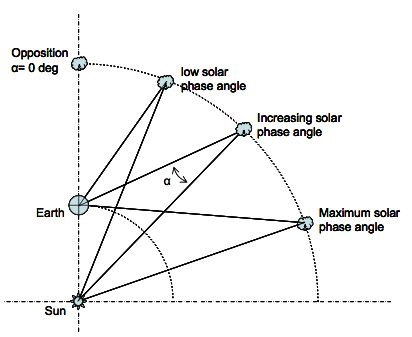
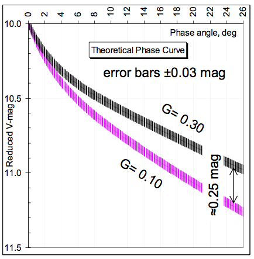
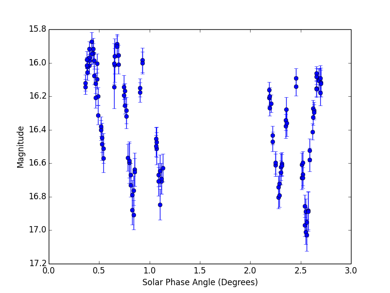
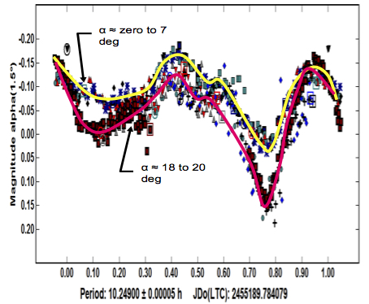
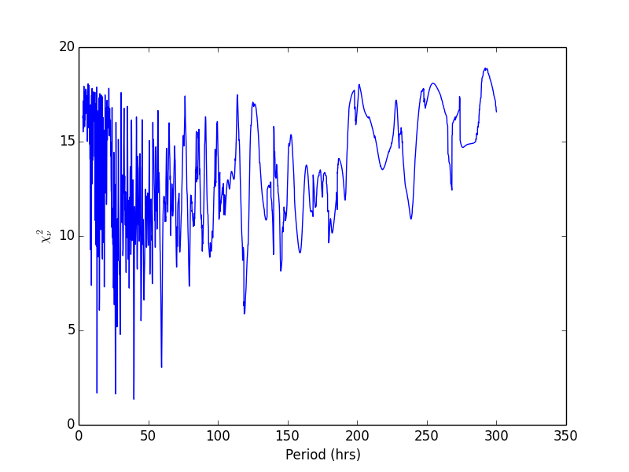
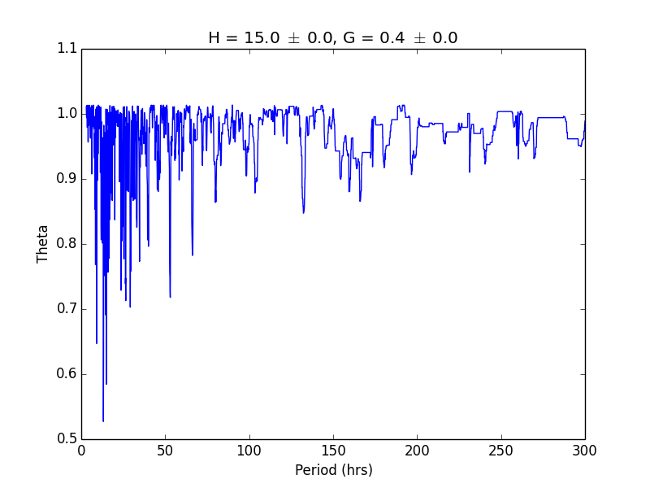
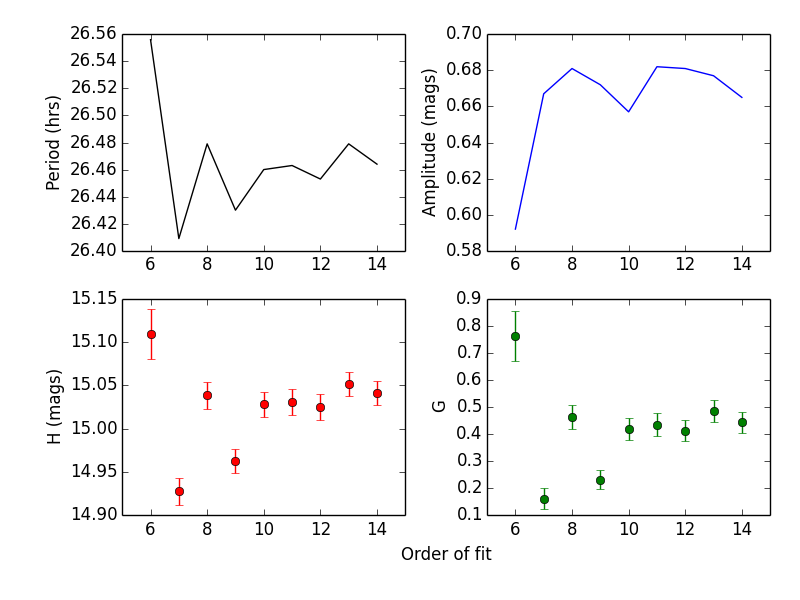
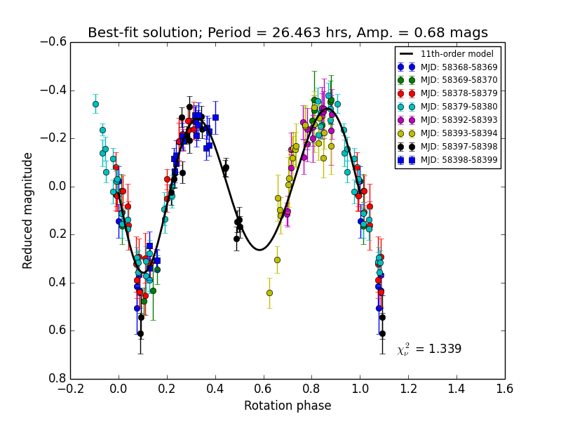
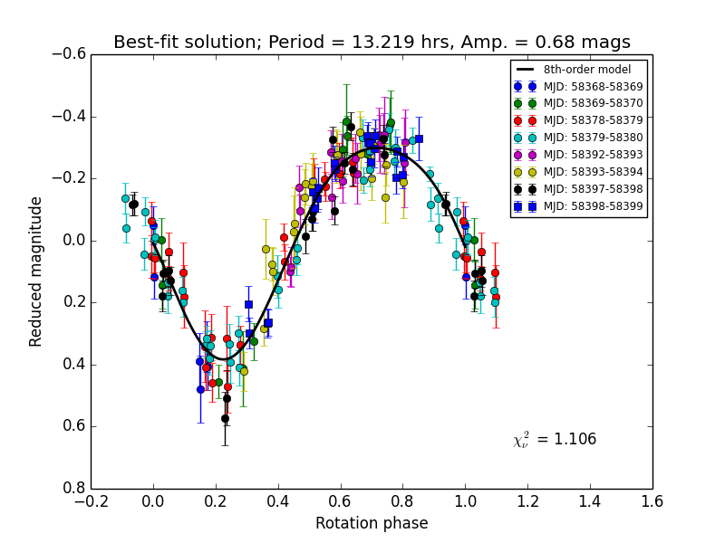

# SpinDoc

Tools for determining asteroid rotation periods, light-curve amplitudes, and H-G phase function parameters from calibrated photometry.

---

## Background

### Rotation period and H-G phase function

An asteroid light curve's rotation period and amplitude are fairly intuitive physical properties. The solar phase function is less so, but can also deliver rich information about the surfaces of asteroids.

The solar phase function is the measure of how an asteroid's brightness changes as the observer–asteroid–Sun angle (solar phase angle; α) changes. An asteroid with high porosity, lots of craters, or a very rough surface will get much dimmer as α increases because more shadows appear:



The parameters **H** and **G** describe the y-intercept and steepness of the phase curve, respectively. **H** is the absolute magnitude — the brightness an object would have if it were 1 AU from the Earth, 1 AU from the Sun, and at a phase angle of 0°. This is an unphysical situation, but it is useful for comparing solar system bodies. Since surface reflectivity changes with wavelength, H-magnitude differs for different broadband filters (V-filter H is standard). Lower H means brighter.

The phase function looks something like this:





Over a small range of phase angles the reduced magnitude may not change much. Most asteroids move only a few degrees in phase angle over a month — much shorter than a typical rotation period — so asteroids with large-amplitude light curves will show rotational brightness variation much larger than their phase-curve effect.

To see the phase curve, we must account for rotational modulation. One further complication: light-curve amplitude can vary slightly with phase angle:



### Algorithm

Fit the rotation period, amplitude, H, and G iteratively by phasing the data at different period, H, and G values and minimizing the reduced chi-squared statistic until convergence.

The rotation solution is sensitive to the H-G parameters (incorrect H-G values can make the data align better at the wrong period), and the H-G parameters are sensitive to the rotation period. For now we ignore the amplitude dependence on phase angle, since the phase angles sampled in typical datasets rarely span more than 10°.

---

## Installation

```bash
git clone https://github.com/ssonnett/SpinDoc.git
cd SpinDoc
pip install numpy matplotlib scipy
```

No package installation step is required — import from `spindoc` works from the repo root.

---

## Package structure

```
SpinDoc/
├── spindoc/
│   ├── __init__.py        # public API
│   ├── hg.py              # IAU H-G phase function
│   ├── fourier.py         # Fourier series models
│   ├── utils.py           # date conversion, chi-squared, directory helpers
│   └── io.py              # photometry file reader
├── period_search.py       # iterative period + H-G fitter
├── period_uncertainty.py  # bootstrap period uncertainty
└── docs/images/           # figures referenced in this README
```

---

## Usage

### Step 1 — Period and H-G search

Run the code that fits period, H, and G iteratively using a broad period range first:

```bash
python period_search.py \
    --infile  Target_Calibrated_FinalErr_cleaned.txt \
    --object  3923 \
    --minper  2. \
    --maxper  300.
```

**Examine the output.** Look first at the periodograms in the newly created `PeriodHGSearch_<filter>/Periodograms/` directory. The code computes reduced chi-squared periodograms across several Fourier series orders. Look at the 1st iteration to see the broadest range of periods. The minima represent the best period solutions:




If reduced chi-squared never falls below ~3, you have poor fits and may not have a good period solution in that plot.

**Examine the summary.** Look at `PeriodHGSearch_<filter>/Summary.*` to identify at which Fourier order the four parameters (period, amplitude, H, G) begin to converge. Select the *lowest* order that achieves convergence — this protects against over-fitting.



**Examine the phased light curve** for the chosen order (3rd iteration). A typical asteroid light curve has two maxima per rotation. If the best-fit solution shows only one maximum, the true period is probably twice the best-fit value:




In that case, rerun with a tighter period range centred on the double-period solution:

```bash
python period_search.py \
    --infile  Target_Calibrated_FinalErr_cleaned.txt \
    --object  3923 \
    --minper  24. \
    --maxper  28.
```

Repeat until the period solution is isolated.

### Step 2 — Period and amplitude uncertainties

Use a bootstrapping technique: randomly vary the photometry within its error bars (Gaussian random factor) and refit the light curve for a user-defined number of trials. The FWHMs of the resulting period and amplitude distributions are the uncertainties.

```bash
python period_uncertainty.py \
    --infile   Target_Calibrated_FinalErr_cleaned.txt \
    --objname  3923 \
    --period   26.463 \
    --order    3 \
    --ntrials  1000
```

> **Note:** Uncertainties on H and G should come from the final solar phase function plot, not from this uncertainty algorithm.

---

## Command-line reference

### `period_search.py`

| Argument | Default | Description |
|---|---|---|
| `--infile` | — | Input photometry file |
| `--object` | — | Object name (used in plot titles) |
| `--format` | `None` | Column layout (`None` = default; any other value = compact 7-column format) |
| `--minper` | `2.0` | Minimum search period (hours) |
| `--maxper` | `300.0` | Maximum search period (hours) |
| `--dPstart` | `0.1` | Initial period grid step (hours) |
| `--niterations` | `3` | Number of period–H-G convergence iterations |
| `--sepfilter` | `True` | Analyze each filter separately |
| `--exactrange` | `False` | Keep search range fixed across iterations |
| `--phaseshift` | `0.0` | Additive shift to rotation phase |
| `--writesubtracteddata` | `False` | Write model-subtracted data file |
| `--excludedates` | `None` | Date range to exclude from fitting (e.g. `20100829_20100831` or `56789.123_56789.567`) |

### `period_uncertainty.py`

| Argument | Default | Description |
|---|---|---|
| `--infile` | — | Input photometry file |
| `--objname` | — | Object name |
| `--period` | — | Best-fit period from `period_search.py` (hours) |
| `--order` | — | Fourier order that best fit the data |
| `--ntrials` | `100` | Number of Monte Carlo trials |
| `--sepfilter` | `True` | Analyze each filter separately |
| `--phaseshift` | `0.0` | Additive shift to rotation phase |

---

## Input file format

Default format (11 columns, 1 header row):

| Col | Content |
|---|---|
| 1 | heliocentric distance (AU) |
| 2 | geocentric distance (AU) |
| 3 | solar phase angle (degrees) |
| 5 | filter |
| 7 | MJD |
| 8 | calibrated magnitude |
| 10 | magnitude uncertainty |

Compact format (`--format compact`, 7 data columns): MJD, helio, geo, alpha, mag, merr, filter.

---

## Author

Alla Sonnett
